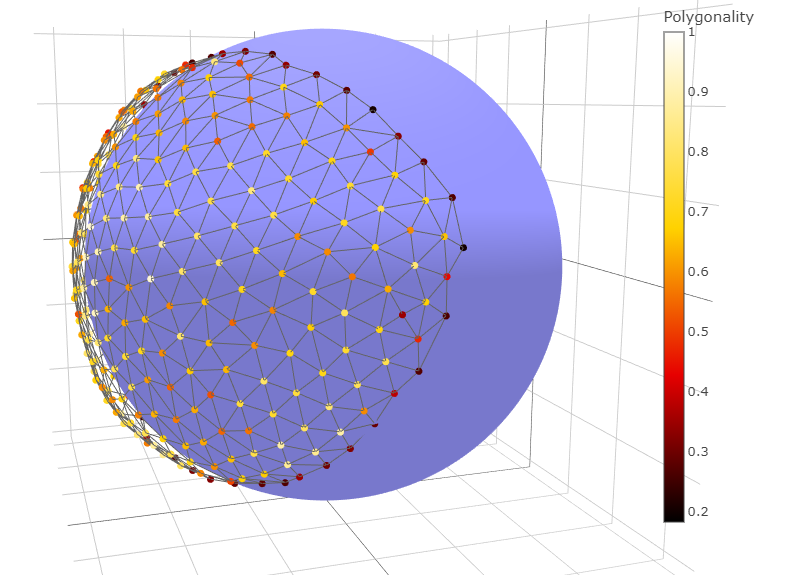

# Regularity 3D



Calculate the regularity of a point cloud using the methodology described in [Quantifying the Regularity of a 3D Set of Points on the Surface of an Ellipsoidal Object](https://www.sciencedirect.com/science/article/abs/pii/S0167865520300519). It is assumed that the points are distributed approximately along the surface of an ellipsoid. The regularity is quantified as an extension of the polygonality to 3D point clouds.

The main function to use is regularity_3d() from file [regularity_3d.py](regularity_3d/regularity_3d.py). Please refer to the documentation of that function (and also of the function polygonality() in the same file) for usage details. 

The steps of the methodology described in the paper are implemented in the following functions:

#### Section 3.1 Ellipsoid Fitting
Lines 347 to 351 of function regularity_3d in file [regularity_3d.py](regularity_3d/regularity_3d.py)
#### Section 3.2 Border Detection
Function get_border_2D() in file [regularity_3d.py](regularity_3d/regularity_3d.py)
#### Section 3.3 Voronoi Tessellation
File [voronoi_3d.py](regularity_3d/voronoi_3d.py)
#### Section 3.4 Obtaining a Triangular Tilling of the Ellipsoid
File [hexagonal_grid.py](regularity_3d/hexagonal_grid.py)
#### Section 3.5 Polygonality Calculation
Function polygonality() in file [regularity_3d.py](regularity_3d/regularity_3d.py)

An example dataset of the fundus gnat eye is included in the data directory.

Example usage for the fundus gnat data:

```python
import regularity_3d
import util

input_file = 'DriedGnattData'
output_file = 'measurements'

facets = util.read_facets('data/%s_facet_pts.csv'%input_file)

# Calculate facet centers
facet_centers = util.get_facet_centers(facets)
prop_dict = regularity_3d.regularity_3d(facet_centers, d_max=5., plot_data=True)

# Store the result in a database
with shelve.open(output_file) as mea_db:
	mea_db[input_file] = prop_dict
	
polygonality = prop_dict['polygonality']
```

### Dependencies (version)
* Python version 3.7.1
* numpy (1.16.2)
* scipy (1.2.1)
* python-igraph (0.7.1.post6)
* shapely (1.6.4.post1)
* plotly (3.7.0)
